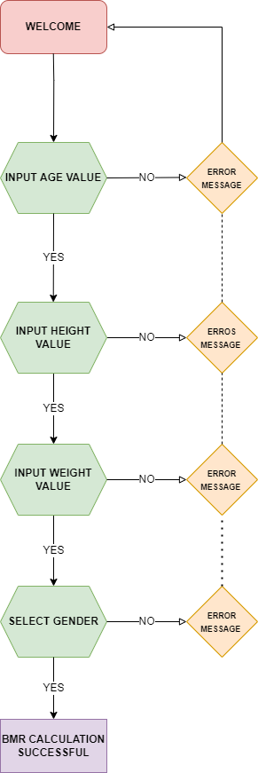
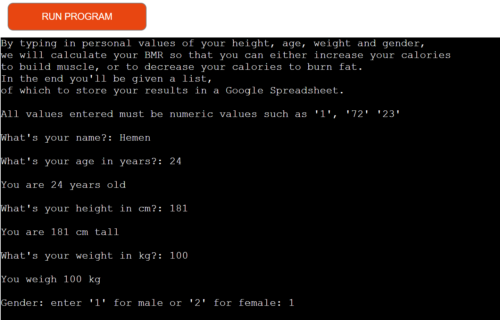
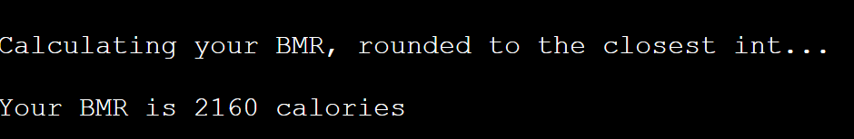
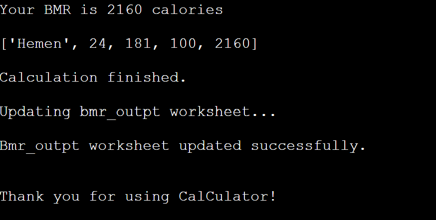
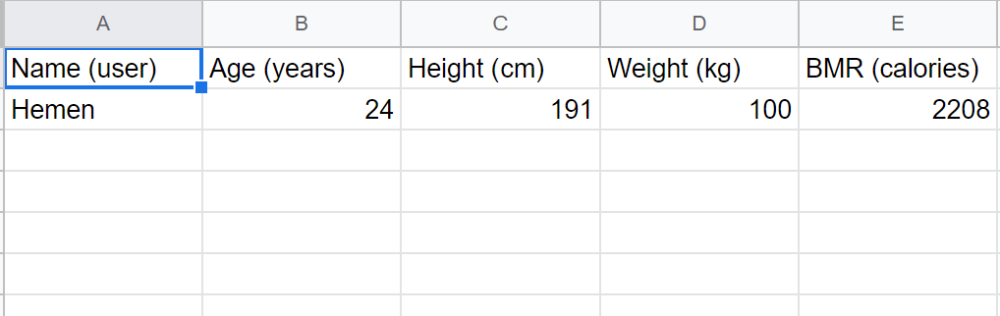
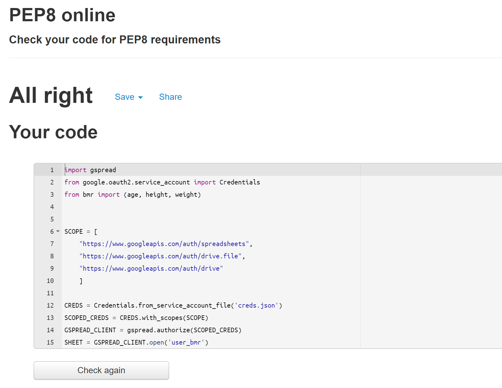

# CalCulator 

[View the published application on Heroku](https://cal-culators.herokuapp.com/)

[View Google Sheets used for the project](https://docs.google.com/spreadsheets/d/1Em1IxjtKPEYA8Kc-0m8CRgSNmk6oF-ZLwpCXgDp_-kU/edit#gid=0)

## Project Overview

CalCulator is a terminal based app that allows the user to calculate their Basal Metabolic Rate, or BMR. This has been created as part of my Project 3 for Code Institute.

## Table of Contents

1. [Strategy](#strategy)
    * [Project Goals](#project-goals)
    * [User Intention](#user-intention)
    * [Scope](#scope)
    * [Design](#design)
    * [Skeleton](#skeleton)
        * [Flowchart](#flowchart)
2. [Features](#features)
    * [Current Features](#current-features)
    * [Future Features](#future-features)
3. [Technologies Uses](#tech-used)
4. [Testing](#testing)
    * [App Usage](#app-usage)
    * [Validation Testing](#val-test)
    * [Known Bugs and Fixes](#bugs-fix)
5. [Deployment](#deployment)
6. [Credits](#credits)

## Strategy 

### Project Goals 

The goal of CalCulator is to provide a terminal-based app that allows the user to close to accuratley calculate their Basal Metabolic Rate (BMR), so that they would have an estimation of how many calories they need to consume to either gain weight or to lose weight. The result from the calculation will then be exported onto a Google Sheet, so that the user can store their data, and track their progress any time they decide to use the application.

The target audience of this app is anyone that wants to get into fitness and not over- or under eat, to get their desired results. 

### User Intention 

* __App User Goals:__

    * I want to get an estimation of my BMR.
    * I want to be able to store my results in a Google Sheet so that I can access it anytime to update my calculation

* __App Owner Goals:__

    * I want to provide an app for the general public that calculates a user's BMR.
    * I want provide the user a way to store their results in a Google Sheet so that they may update their results depending on their active goals. 

## Scope 

To achieve the goals set for this project, I will implement the following features:

* A function that will take the user's age and create a formula that will be implemented differently depending on the user's gender
* A function that will take the user's height and create a formula that will be implemented differently depending on the user's gender
* A function that will take the user's weight and create a formula that will be implemented differently depending on the user's gender
* An if statement that will execute two different calculations depending on the gender which the user selected.
* A function that will export the variables entered by the user and their results, and export them onto a Google Sheet.

## Design 

The design of this project is very simple, as this is a strictly terminal-based application. A flowchart has been made to demonstrate the process of the app.

## Skeleton 

### Flowchart 

This flowchart was created using [diagrams.net](https://www.diagrams.net/)

## Features 

### Current Features 

__Main__:

The main() function's purpose is where all other functions are executed in order, for the app. Once this function has finished running, the app is ended, and the user is presented with a message, thanking them for their usage. The code that exports and stores the results in a Google Sheet can be found in this function, close to the bottom.

__Age Variable__:

The age_men_bmr() and age_women_bmr() functions contain formulas to measure the age variable in the BMR formula. They have been assigned to a module so that the run.py file isn't being cluttered with too much code. These two functions are imported to the main file for usage.

__Height Variable__:

The height_men_bmr() and height_women_bmr() functions contain formulas to measure the height variable in the BMR formula. They have been assigned to a module so that the run.py file isn't being cluttered with too much code.Like the previous paragraph states, these two functions are imported to the main file for usage.

__Weight Variable__:

The weight_men_bmr() and weight_women_bmr() functions contain formulas to measure the weight variable in the BMR formula. They have been assigned to a module so that the run.py file isn't being cluttered with too much code.Like the previous paragraphs state, these two functions are imported to the main file for usage.

### Future Features 

Due to the short amount of time, I was not able to implement additional features. The future features are the following:

* Add a function giving the user an option to either gain or lose weight, which will calculate the necessary amount of calories they need to consume daily. The additon or subtraction of the BMR will be 200-500 kcal (calories) a day depending on how fast they wish to see their results.
* A function which will track the user's progress by asking the user to input their weight only. This should be enough information to determining their BMR, as the other variables would remain constant (save for the age variable, but that would rarely change).

## Technologies Used 

For this project, the main language used is Python.

I have also used the following tools:

* [GitPod](https://www.gitpod.io/):
    * I used GitPod as the IDE for CalCulator and git has been used as version control.
* [Github](https://www.github.com/):
    * GitHub was used to create and store the repository, and also received regular commits from GitPod.
* [Heroku](https://www.heroku.com/):
    * Heroku was used to deploy this project.
* [gspread](https://pypi.org/project/gspread/):
    * gspread was used to store and update the finished calculation and the user's variables.
* [diagrams.net][diagrams.net](https://www.diagrams.net/):
    * diagrams.net was used to create the flowchart.
* [AmIResponsive](http://ami.responsivedesign.is/):
    * Am I Responsive was used to showcase the application in this README.
* [PEP8 Online Validation Service](http://pep8online.com/): 
    * PEP8 was used to validate the python code for this project, by finding any erros and or bugs, which could then be adressed

## Testing 

### App Usage 

When the user opens the application on heroku they are greeting with a message explaining the purpose of the app and how to use it.

Screenshot of starting the app:

The user is then prompted to enter peronal data regarding their age, height, weight and gender. For the project's purpose the gender is specified to biological gender. 

Screenshot of these variables entered:

Next, once all variables have been entered the app automatically calculates the user's BMR, presented as 'x calories'.

Screenshot of the result:

Lastly, the app generates a list of all variables and the BMR result, which is then exported and stored in a Google Sheet. 

Screenshots of the updates:

Google Sheet:

### Validation Testing 

To test the python code, PEP8 was used,

No issues were detected in the code.

This app was tested on the following browsers:

* Google Chrome
* Safari 

The app has also been used on different devices, such as:

* PC desktop
* iPhone 12 Pro
* MacBook Pro

### Known Bugs and Fixes 

* When testing the app in it's final form I noticed an issue regarding the bmr calculation. The calculation would provide the user with both the male and female BMR. To solve this, I had to create an if statement that would take the user's gender input and execute the calculation depending on wether the input entered was '1' or any other numeric value.
* Another issue was regarding the export of the results and variables to the Google Sheet. I could not create a seperate function updating the Google Sheet, as the 'user_list' variable was local to the main() function, and could not be accessed by a different function. Therefore, I had to solve this issue by typing the code inside the main() function, close to the bottom.

## Deployment 

This project was developed using GitPod and deployed via GitHub to Heroku.

The following steps were taken to deploy this project:

1. From the Heroku dashboard, select 'New' and 'create new app'.
2. Type in the app name and then choose the region closest to your location, then click on 'Create app'.
3. Next click on 'Add buildpack' and select 'python' and 'nodejs' in that order.
4. In the application dashboard go to settings and click on 'Reveal Config Vars'.
5. In the 'KEY' tab, type 'PORT'. In the 'VALUE' tab type '8000'.
6. Add a new config vars but this time enter 'CREDS' in the 'KEY' tab and the contents of the creds.json file in the 'VALUE' tab.
7. Then, at the top of the page click on the 'Deploy' section.
8. Here, select 'GitHub' as the deployment method.
9. Connect to your GitHub account and then in the 'Connect to Github' section, search for the project repository and press 'Connect'.
10. Scroll down and select 'Enable Automatic Deployments', and select 'Deploy Branch' to deploy the project.
11. When the project has been successfully deployed, click on the 'view' button, which will appear on the screen. When clicked, it will open the deployed application. 

## Credits 

* The formulae for the BMR calculation where found at [garnethealth](https://www.garnethealth.org/news/basal-metabolic-rate-calculator)

* Code Institute's Love Sandwiches tutorial was of great help when developing this project. Especially so when I typed the code to update the Google Sheet with the user's results and variables.

* I should also like to thank my mentor, Guido Cecilio, for his incredible feedback and help, as he provided me with much needed guidance regarding the betterment of the project. 
