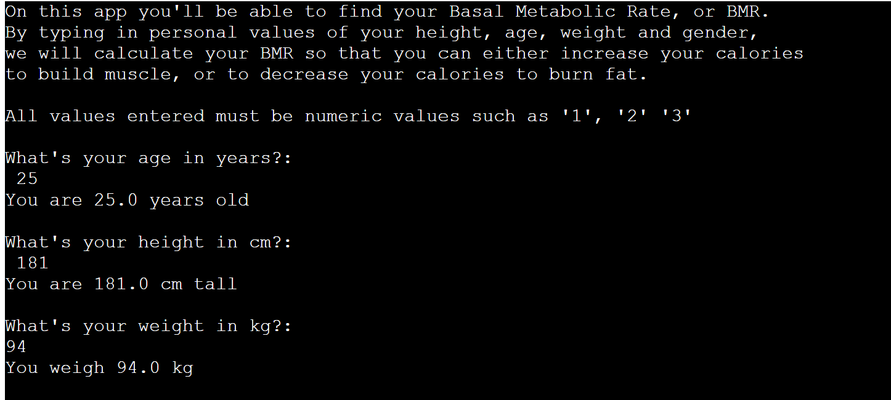
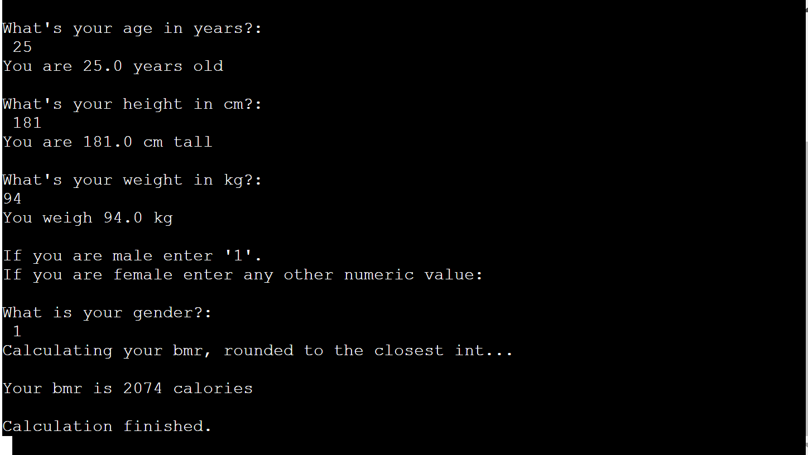

# CalCulator

This is an app that calculates the basal metabolic rate (BMR), which is caloric expenditure that a person's body burns when only doing basal tasks. 

This is a simplistic calculation that takes a few different variables: height, weight and age of the user, and then calculates their BMR. 

[Live Version Of The App](https://cal-culators.herokuapp.com/)

## How to use

CalCulator consists of four different inputs, where the user enters some personal data which will be used to calculate their BMR. The data is age in years, weight in kilograms, height in centimetres and their gender (male or female).

## Features

- Prints a message welcoming the user to the app, and giving quick instructions.
- The computer automatically starts asking the user to enter their information to use for the calculation.

- The user is asked to enter their gender, which is necessary to determine their basal metabolic rate.

- Finally the computer generates the user's basal metabolic rate. In the example above, a 25 yeard old male, standing at 181 cm tall and weighing 94 kg, has a bmr of 2074 calories.
- With this information the user is able to determine how many calories they need to consume to either gain or lose weight, depending on their goal.

### Technologies Used

- [Python](https://www.python.org/)
- [Heroku](https://www.heroku.com/)

### Testing

- Manually tested the code and no bugs were found.

