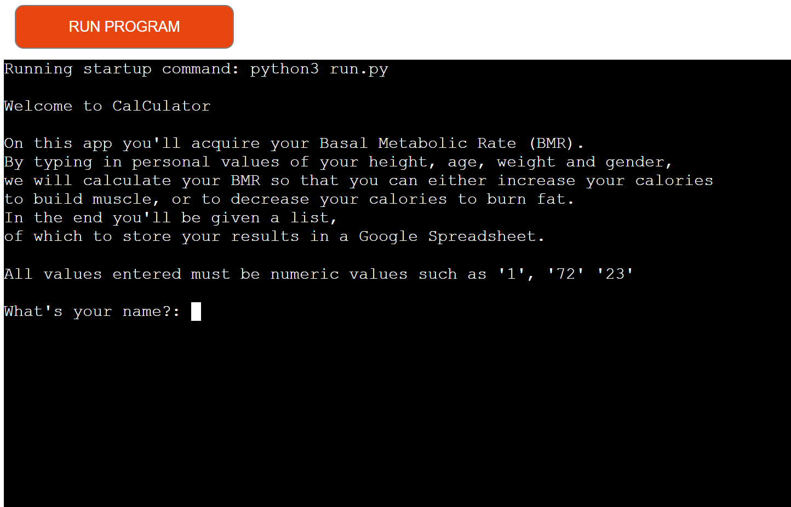

# CalCulator 

[View the published application on Heroku](https://cal-culators.herokuapp.com/)

[View Google Sheets used for the project](https://docs.google.com/spreadsheets/d/1Em1IxjtKPEYA8Kc-0m8CRgSNmk6oF-ZLwpCXgDp_-kU/edit#gid=0)

## Project Overview

CalCulator is a terminal based app that allows the user to calculate their Basal Metabolic Rate, or BMR. This has been created as part of my Project 3 for Code Institute.

## Table of Contents

1. [Strategy](#strategy)
    * [Project Goals](#project-goals)
    * [User Intention](#user-intention)
    * [Scope](#scope)
    * [Design]
    * [Skeleton]
        * [Flowchart]
2. [Features]
    * [Current Features]
    * [Future Features]
3. [Technologies Uses]
4. [Testing]
    * [Validation Testing]
    * [Known Bugs and Fixes]
5. [Deployment]
6. [Credits]

## Strategy 

### Project Goals 

The goal of CalCulator is to provide a terminal-based app that allows the user to close to accuratley calculate their Basal Metabolic Rate (BMR), so that they would have an estimation of how many calories they need to consume to either gain weight or to lose weight. The result from the calculation will then be exported onto a Google Sheet, so that the user can store their data, and track their progress any time they decide to use the application.

The target audience of this app is anyone that wants to get into fitness and not over- or under eat, to get their desired results. 

### User Intention 

* __App User Goals:__

    * I want to get an estimation of my BMR.
    * I want to be able to store my results in a Google Sheet so that I can access it anytime to update my calculation

* __App Owner Goals:__

    * I want to provide an app for the general public that calculates a user's BMR.
    * I want provide the user a way to store their results in a Google Sheet so that they may update their results depending on their active goals. 

## Scope 

To achieve the goals set for this project, I will implement the following features:

* A function that will take the user's age and create a formula that will be implemented differently depending on the user's gender
* A function that will take the user's height and create a formula that will be implemented differently depending on the user's gender
* A function that will take the user's weight and create a formula that will be implemented differently depending on the user's gender
* An if statement that will execute two different calculations depending on the gender which the user selected.
* A function that will export the variables entered by the user and their results, and export them onto a Google Sheet.

